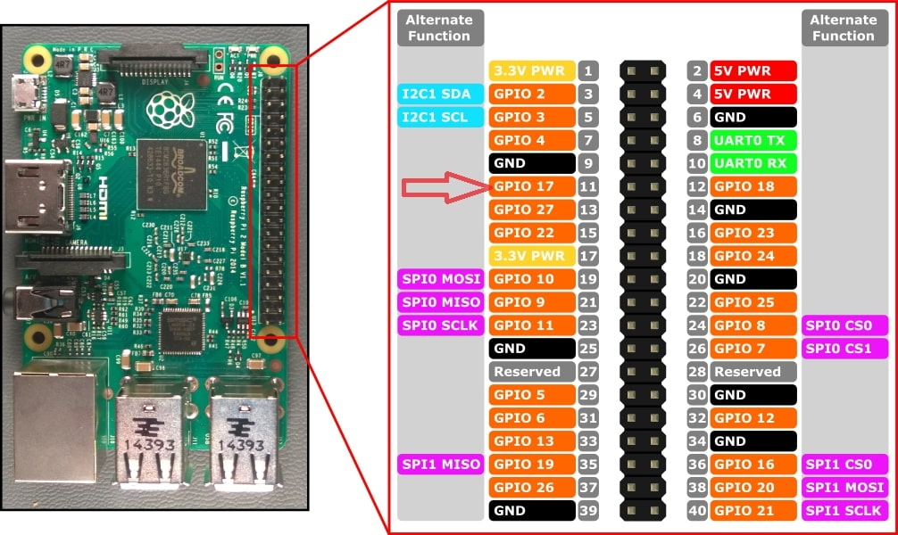

# MVP Documentation
## MVP 4: Amperage and State of Charge (SOC) Broadcasting over CAN Bus

### Release Date
April 4, 2024

### Objectives
1. Make AMP Gauge work fine first, test, validate the code
2. Add AMP to SOC Gauges, test, validate the code 
3. Add level of configurability. `CANBus_Amp_and_BatteryLevel_Publisher.json` config file that you can configure both.
4. After finishing the above steps, we can add the Gauges in your cluster, one by one to our previously developed code.
5. Then we can make generic code to support all Gauges using the config file.

### Achievements
- **Dynamic Configuration:** Introduced a JSON-based configuration system allowing for easy adjustment of CAN parameters (ID, bitrate, AMP, and SOC range) without modifying the script code.
- **SOC and AMP Broadcasting Script:** Developed and successfully tested a Python script (`CANBus_Amp_and_BatteryLevel_Publisher.py`) that cycles through AMP values from -200 to 1201 and SOC values from 0% to 100%, broadcasting each value over the CAN bus.
- **Graceful Shutdown:** Enhanced the script with a mechanism for graceful shutdown upon receiving a keyboard interrupt (CTRL+C), ensuring clean script termination.
- All objectives were achieved, except for adding the Gauges in your cluster due to the unavailability of other gauges.

### Technical Details and References
- The AMP and SOC values are encoded and sent using specific CAN message structures, dictated by the `config/CANBus_Amp_and_BatteryLevel_Publisher.json` configuration file. This includes the start bit, bit length, scaling, and CAN ID in HEX format.
- Utilized the `python-can` library for CAN interface interaction, demonstrating a programmable method for sending CAN messages based on dynamic AMP and SOC values.
- Script execution and interruption are handled cleanly, providing feedback to the user upon shutdown.

### Configuration File Breakdown
The configuration file (`CANBus_Amp_and_BatteryLevel_Publisher.json`) includes several key parameters:
- `can_id_hex`: The CAN ID in hexadecimal format.
- `message_details`: Object specifying message encoding details such as start bit, bit length, scaling, and offset for both AMP and SOC values.
- `baud_rate`: The baud rate for CAN communication.
- `can_channel`: Specifies the CAN interface channel (e.g., `can0`).
- `amps_value_range`: Defines the range for cycling AMP values.
- `battery_level_range`: Defines the range for cycling SOC values.

### Script Usage
To run the script, navigate to the script's directory and execute:
```bash
python3 CANBus_Amp_and_BatteryLevel_Publisher.py
```
Ensure the CAN interface is correctly set up on your Raspberry Pi and the `python-can` library is installed.

### References
- [2-1/16" EV Amp Gauge -200 to 1200 (AEM)](https://speedhut.com/gauge-applications/2-1-16-ev-amp-gauge-200-to-1200-aem/?dd-link=0l8upv39raa)
- [Python-CAN Documentation](https://python-can.readthedocs.io/en/stable/)
- [2-1/16" EV Battery Level / SOC Gauge 0-100% (w/ warning) (AEM)](https://speedhut.com/gauge-applications/2-1-16-ev-battery-level-soc-gauge-0-100-w-warning-aem/?dd-link=0l8upv39raa)
- [EV_Gauge_Instructions - it has the CAN Message Format](https://github.com/aabdelghani/EVProCANBridge/blob/main/docs/2-116%20EV%20Battery%20Level%20%20SOC%20Gauge%200-100%20(w%20warning)%20(AEM).pdf)
  
### Customer Feedback
- The Battery level and AMP Gauge cluster are working perfectly based on the script `CANBus_Amp_and_BatteryLevel_Publisher.py` that utilized `can1` to send the battery percentage and AMP values with the needed config file.

### Action Items
- [x] Collect customer feedback on SOC and AMP broadcasting functionality.
- [x] Investigate enhancements for SOC and AMP message encoding and broadcasting efficiency.
- [x] Develop a generic script to support all gauges using the config file.
- [ ] Add the Gauges in your cluster one by one to our previously developed code (Pending due to unavailability of other gauges).


## MVP 3: State of Charge (SOC) Broadcasting over CAN Bus

### Release Date
March 30, 2024

### Objectives
- Implement SOC broadcasting over the CAN bus using a Python script.
- Allow dynamic configuration of CAN message parameters through an external JSON file.
- Demonstrate cycling SOC values from 0% to 100% and broadcasting these over CAN.

### Achievements
- **Dynamic Configuration:** Introduced a JSON-based configuration system allowing for easy adjustment of CAN parameters (ID, bitrate, SOC range) without modifying the script code.
- **SOC Broadcasting Script:** Developed and successfully tested a Python script (`BatterySOC_CAN_Publisher.py`) that cycles through SOC values from 0% to 100%, broadcasting each value over the CAN bus.
- **Graceful Shutdown:** Enhanced the script with a mechanism for graceful shutdown upon receiving a keyboard interrupt (CTRL+C), ensuring clean script termination.

### Technical Details and References
- The SOC values are encoded and sent using a specific CAN message structure, dictated by the `config/BatterySOC_CAN_Publisher.json` configuration file. This includes the start bit, bit length, scaling, and CAN ID in HEX format.
- Utilized the `python-can` library for CAN interface interaction, demonstrating a programmable method for sending CAN messages based on dynamic SOC values.
- Script execution and interruption are handled cleanly, providing feedback to the user upon shutdown.

### Configuration File Breakdown
The configuration file (`BatterySOC_CAN_Publisher.json`) includes several key parameters:
- `can_id_hex`: The CAN ID in hexadecimal format.
- `message_details`: Object specifying message encoding details such as start bit, bit length, scaling, and offset.
- `baud_rate`: The baud rate for CAN communication.
- `can_channel`: Specifies the CAN interface channel (e.g., `can0`).
- `battery_percentage_range`: Defines the range for cycling SOC values.

### Script Usage
To run the script, navigate to the script's directory and execute:
```bash
python3 BatterySOC_CAN_Publisher.py
```
Ensure the CAN interface is correctly set up on your Raspberry Pi and the `python-can` library is installed.

### References
- [Python-CAN Documentation](https://python-can.readthedocs.io/en/stable/)
- [2-1/16" EV Battery Level / SOC Gauge 0-100% (w/ warning) (AEM)](https://speedhut.com/gauge-applications/2-1-16-ev-battery-level-soc-gauge-0-100-w-warning-aem/?dd-link=0l8upv39raa)
- [EV_Gauge_Instructions - it has the CAN Message Format](https://github.com/aabdelghani/EVProCANBridge/blob/main/docs/2-116%20EV%20Battery%20Level%20%20SOC%20Gauge%200-100%20(w%20warning)%20(AEM).pdf) 
  
### Customer Feedback
- The Battery level Gauge cluster working perfectly based on the script 'src/BatterySOC_CAN_Publisher.py' that utilized can1 to send the battery percentage from 0 to 100. with the needed config file

### Action Items
- [x] Collect customer feedback on SOC broadcasting functionality.
- [x] Investigate enhancements for SOC message encoding and broadcasting efficiency.
- [x] Develop the same script but make it work with the AMP Gauge 


# MVP 2: Sending and Receiving CAN Messages with Physical Feedback
### Release Date
March 28, 2024

## Overview
Building on the success of the initial MVP, which established reliable CAN communication on a Raspberry Pi, the next milestone (MVP2) aims to demonstrate a practical application of CAN bus communication by creating and transmitting a specific CAN message from one interface and receiving it on another. Upon successful reception, a connected LED will be illuminated as a physical indicator of success.

## Objectives
- Create a specific CAN message to be sent over the CAN bus.
- Transmit the message from CAN0 interface.
- Receive the message using the CAN1 interface.
- Use the reception of the message as a trigger to turn on an LED, providing a visual indication of successful communication.

## Technical Approach
1. **Message Creation**: Define a unique CAN message with a specific arbitration ID and data payload.
2. **Transmission**: Use the configured `can0` interface to send the created message into the CAN network.
3. **Reception**: Continuously monitor the `can1` interface for incoming messages. When the specific message is detected, trigger a GPIO pin on the Raspberry Pi to turn on an LED.
4. **Feedback**: Implement a simple feedback mechanism to visually indicate the success of the message transmission and reception process.

## Script Functionality

The scripts developed as part of our project have specific functionalities tied to the Raspberry Pi's GPIO pins, particularly GPIO pin 17. One of the key scripts toggles the state of GPIO pin 17 to demonstrate physical interaction with the hardware. This is used as an indication of successful CAN message reception.


## How to Run the Scripts for MVP2

### Prerequisites
Before running the scripts, ensure you have the following prerequisites installed on your Raspberry Pi:
- Python 3.x
- `python-can` library
- `RPi.GPIO` library (for the receiving script)
- Connecting LED to GPIO 17 



*Figure: Visual representation of GPIO pin 17 being toggled by the script.*

You can install the required Python libraries using pip:
```sh
pip3 install python-can RPi.GPIO
```

### Sending a CAN Message [send_can_message_v1.py](https://github.com/aabdelghani/EVProCANBridge/blob/main/send_can_message_v1.py) 
1. **Prepare the Script**: Make sure the [send_can_message_v1.py](https://github.com/aabdelghani/EVProCANBridge/blob/main/send_can_message_v1.py) script is saved on your Raspberry Pi.
2. **Run the Script**: Open a terminal and navigate to the directory containing the script. Execute the script by running:
   ```sh
   python3 send_can_message_v1.py
   ```
   This will send a predefined CAN message over the `can0` interface.

### Receiving CAN Messages and Toggling an LED [receive_can_message_v1.py](https://github.com/aabdelghani/EVProCANBridge/blob/main/recieve_can_messsage_v1.py)
1. **Hardware Setup**: Connect an LED to the designated GPIO pin on your Raspberry Pi. For the purposes of the script, we're using GPIO pin 17.
2. **Prepare the Script**: Ensure the `receive_can_message.py` script is saved on your Raspberry Pi, and it's configured to listen on the `can1` interface and to toggle the connected LED.
3. **Run the Script**: Open a new terminal window and navigate to the directory containing the `receive_can_message.py` script. Execute the script by running:
   ```sh
   python3 recieve_can_messsage_v1.py
   ```
   The script will listen for the specific CAN message. When the message is received, it will toggle the state of the LED.

### Note
- These scripts require administrative privileges to access the CAN interfaces and GPIO pins. If you encounter permission issues, prepend `sudo` to the Python command:
  ```sh
  sudo python3 send_can_message_v1.py
  ```
  ```sh
  sudo python3 receive_can_message.py
  ```

- To stop the scripts, especially the receiving script which runs in a loop, press `Ctrl+C` in the terminal.

This setup allows you to demonstrate the interaction between sending and receiving CAN messages and performing a physical action (toggling an LED) in response, illustrating the capabilities of your system in real-time.

### References
Pending

### Customer Feedback
Pending

### Action Items
- [x] **Define the CAN Message**: Specify the arbitration ID and data payload for the CAN message that will be used to trigger the LED.
- [x] **Develop Transmission Code**: Write and test the code that will send the specified CAN message over the `can0` interface.
- [x] **Develop Reception Code**: Implement the code that monitors incoming messages on the `can1` interface, looking specifically for the defined CAN message.
- [ ] **Hardware Setup**: Connect an LED to the appropriate GPIO pin on the Raspberry Pi, ensuring it can be controlled programmatically.
- [ ] **Implement LED Control Logic**: Integrate the LED control logic into the reception code, so the LED turns on when the specified CAN message is received.
- [ ] **Testing**: Perform comprehensive testing to ensure:
    - The CAN message is correctly formatted and sent over `can0`.
    - The message is accurately received by `can1` without errors.
    - The LED correctly responds to the reception of the message.
- [ ] **Documentation**: Update the project documentation to include:
    - Technical details of the CAN message used.
    - Descriptions of the transmission and reception code.
    - Wiring instructions for connecting the LED to the Raspberry Pi.
    - A troubleshooting guide covering common issues and their resolutions.

## MVP 1: Running CAN Bus Communication Alongside Wireshark on Raspberry Pi

### Release Date
March 27, 2024

### Objectives
- Establish reliable CAN bus communication on Raspberry Pi.
- Monitor CAN bus traffic using Wireshark for analysis and debugging.
- Demonstrate successful installation and execution of Python scripts for CAN bus interaction.

### Achievements
- **CAN Interface Setup:** Configured `can0` and `can1` with specific bitrates and settings for CAN FD.
- **Communication Testing:** Successfully tested CAN FD protocol communication between `can0` and `can1` using `cangen` and `candump` commands.
- **Python-CAN Integration:** Installed python-can library and ran a Python script to receive CAN data, demonstrating programmable interaction with the CAN bus.

### Technical Details and References
- Configured CAN interfaces `can0` and `can1` on the Raspberry Pi using the following commands:
  ```bash
  sudo ip link set can0 up type can bitrate 1000000 dbitrate 8000000 restart-ms 1000 berr-reporting on fd on
  sudo ip link set can1 up type can bitrate 1000000 dbitrate 8000000 restart-ms 1000 berr-reporting on fd on
  sudo ifconfig can0 txqueuelen 65536
  sudo ifconfig can1 txqueuelen 65536
  
## Command Breakdown

- **`sudo`**: Allows running programs with the security privileges of another user, by default the superuser. It's necessary for configuring network interfaces due to the administrative privileges required.

- **`ip link set can0 up`**: Uses the `ip` tool to configure network interfaces. It activates the interface named `can0`, typically the first CAN interface on the system.

- **`type can`**: Specifies the interface type as CAN, a standard designed for microcontrollers and devices to communicate without a host computer.

- **`bitrate 1000000`**: Sets the bitrate for standard CAN frames to 1 Mbps (Mega-bits per second), dictating the speed of data transmission over the CAN network.

- **`dbitrate 8000000`**: Establishes the bitrate for the data phase of CAN FD frames to 8 Mbps. CAN FD, an extension of the original CAN, supports a higher data rate.

- **`restart-ms 1000`**: Defines the automatic retransmission delay to 1000 milliseconds (1 second) in case of bus errors, allowing the system to retry transmission after a brief pause.

- **`berr-reporting on`**: Enables reporting of bus errors, providing diagnostics and error-tracking capabilities for the CAN bus.

- **`fd on`**: Activates support for CAN FD on the interface, allowing for the usage of CAN FD frames that offer increased data capacity and potentially higher data rates than standard frames.

This configuration ensures that the `can0` interface is optimized for performance and reliability, adhering to modern CAN and CAN FD standards.

- Tested CAN FD protocol using `cangen` and `candump`, indicating successful communication setup.
- Attempted to use python-can for CAN data reception, facing initial issues with the script from Seeed Studio documentation.
- Resolved the script issues by following the python-can documentation, leading to successful data reception and sending.

### References
- [2-Channel CAN-BUS FD Shield for Raspberry Pi - Seeed Studio Wiki](https://wiki.seeedstudio.com/2-Channel-CAN-BUS-FD-Shield-for-Raspberry-Pi/)
- [Python-CAN Documentation](https://python-can.readthedocs.io/en/stable/)
- [Python-CAN Listeners and Notifiers Example](https://python-can.readthedocs.io/en/stable/listeners.html)

### Customer Feedback
Pending

### Action Items
- [x] Gather customer feedback on the current MVP functionality and usability.
- [x] Explore additional CAN bus analysis tools that can be integrated with the Raspberry Pi.
- [ ] Consider developing a more user-friendly interface for setting up CAN bus communication and monitoring.
